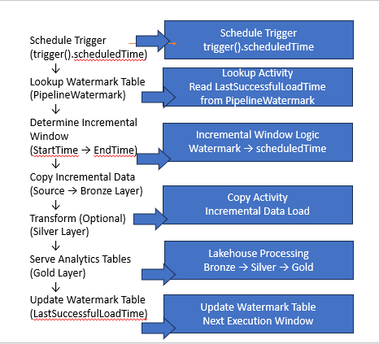

# Fabric-incremental-pipeline-project
## Architecture Diagram


This architecture demonstrates a production-grade incremental ingestion framework in Microsoft Fabric pipelines using trigger().scheduledTime and a watermark control table to ensure deterministic execution windows and retry-safe data processing across Lakehouse layers.
Built a production-safe incremental ingestion framework in Microsoft Fabric pipelines using trigger().scheduledTime and watermark tables to enable deterministic execution windows and reliable Lakehouse data processing.
# Production-Grade Incremental Data Loading in Microsoft Fabric Pipelines
## Architecture Diagram


## Problem Statement

Using utcNow() in incremental pipelines can create inconsistent extraction windows during retries or delayed executions.  
This may result in duplicate records or missed data.

This framework solves the issue using trigger().scheduledTime and a watermark control table.
## Pipeline Flow

Schedule Trigger
→ Lookup Watermark
→ Copy Incremental Data
→ Update Watermark Table
## Watermark Control Table

```sql
CREATE TABLE PipelineWatermark
(
    PipelineName VARCHAR(200),
    LastSuccessfulLoadTime DATETIME2
);

---

## 6️⃣ Incremental Query Logic (Main Highlight Section)

```markdown
## Incremental Extraction Logic

```sql
SELECT *
FROM HR_Source_Table
WHERE LastModifiedDate >
CAST('@{activity('LookupWatermark').output.firstRow.LastSuccessfulLoadTime}' AS DATETIME2)

AND LastModifiedDate <=
CAST('@{formatDateTime(trigger().scheduledTime,'yyyy-MM-dd HH:mm:ss')}' AS DATETIME2)

---

## 7️⃣ Watermark Update Logic

```markdown
## Watermark Update Logic

```sql
UPDATE PipelineWatermark
SET LastSuccessfulLoadTime =
CAST('@{formatDateTime(trigger().scheduledTime,'yyyy-MM-dd HH:mm:ss')}' AS DATETIME2)
WHERE PipelineName = 'HRIncrementalPipeline';

---

## 8️⃣ Benefits Section (Very Important for Recruiters)

```markdown
## Benefits

- retry-safe execution
- deterministic incremental windows
- no duplicate ingestion
- no missing records
- production-ready orchestration
- reusable enterprise ETL framework


